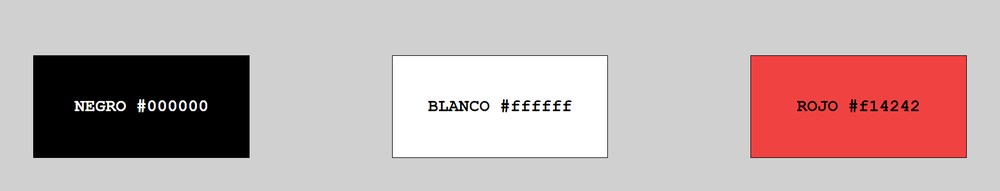

# Documentación de colores para Diseño de Interfaces Web

## Autor: Julio Álvarez Zambrano

### Justificación

Se han elegido los siguientes colores para el diseño de interfaces web:

- Negro (#000000): El color negro se asocia con elegancia, sofisticación y exclusividad. En el contexto de un ecommerce de sneakers, el negro puede transmitir una sensación de estilo y lujo. Además, proporciona un buen contraste para resaltar los detalles y características de los productos.

- Blanco (#FFFFFF): El color blanco se asocia con la pureza, limpieza y simplicidad. En un ecommerce de sneakers, el blanco puede evocar una sensación de frescura y modernidad. También transmite una imagen de claridad y transparencia, lo cual es importante para generar confianza en los clientes.

- Rojo (#F14242): El color rojo #F14242 se caracteriza por ser llamativo y enérgico. En el contexto de un ecommerce de sneakers, el rojo puede transmitir una sensación de pasión y emoción. Además, este color puede captar la atención de los clientes y destacar los productos en la tienda en línea.

### Combinación de colores

La combinación de negro, blanco y rojo crea un contraste visualmente atractivo y equilibrado. El negro y el blanco proporcionan una base neutra y elegante, mientras que el rojo agrega un toque de intensidad y emoción.

### Conclusiones

La elección de los colores negro, blanco y rojo (#F14242) para un ecommerce de sneakers se basa en la intención de transmitir elegancia, estilo, vitalidad y emoción. Estos colores combinados brindan un aspecto moderno y atractivo, al tiempo que resaltan los productos de manera efectiva.

### Captura Colores



### HTML

```
<!DOCTYPE html>
<html lang="es">
  <head>
    <meta charset="UTF-8" />
    <meta name="viewport" content="width=device-width, initial-scale=1.0" />
    <link rel="stylesheet" href="css/styles.css" />
    <title>Cuadrados de Colores</title>
  </head>
  <body>
    <div class="cuadrado negro">NEGRO #000000</div>
    <div class="cuadrado blanco">BLANCO #ffffff</div>
    <div class="cuadrado rojo">ROJO #f14242</div>
  </body>
</html>
```

### CSS

```
body {
  display: flex;
  justify-content: space-around;
  align-items: center;
  height: 100vh;
  background-color: #d0d0d0;
}

.cuadrado {
  width: 20%;
  height: 20%;
  display: flex;
  justify-content: center;
  align-items: center;
  font-size: 24px;
  font-weight: bold;
  margin: 10px;
  border: 1px solid #000000;
  text-align: center;
  font-family: "Courier New", Courier, monospace;
}

.negro {
  background-color: #000000;
  color: #ffffff;
}

.blanco {
  background-color: #ffffff;
}

.rojo {
  background-color: #f14242;
}
```
